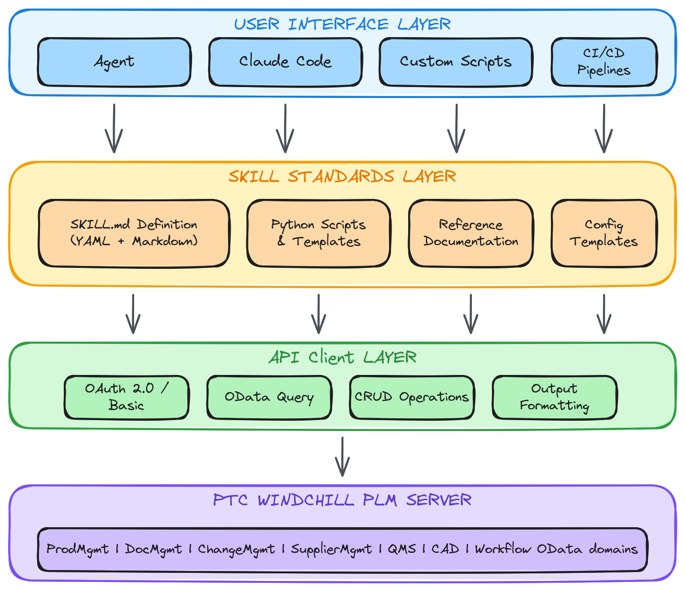

# Zephyr - Windchill PLM Agentic Skill

A comprehensive Python agentic skill for interacting with PTC Windchill PLM REST APIs. Designed for AI agents, CLI automation, CI/CD pipelines, and custom integrations.



## What is an Agentic Skill?

An **Agentic Skill** is a modular capability package designed for AI agents and automation systems. Unlike traditional libraries or APIs, agentic skills are:

- **Agent-Ready**: Pre-packaged with context, examples, and patterns that AI agents can immediately understand and use
- **Self-Documenting**: Contains comprehensive reference documentation, navigation guides, and usage patterns
- **Multi-Modal**: Works across different interfaces - CLI, programmatic API, AI agent prompts, and automation pipelines
- **Composable**: Can be combined with other skills to build complex workflows
- **Context-Aware**: Includes domain knowledge, best practices, and pitfall avoidance built-in

### Why Agentic Skills?

| Traditional Library | Agentic Skill |
|--------------------|---------------|
| Requires reading docs to understand | Self-explaining with examples |
| Single interface (API) | Multiple interfaces (CLI, API, Agent, Pipeline) |
| Documentation separate from code | Documentation integrated and context-rich |
| Manual integration effort | Ready for AI consumption |
| Generic usage patterns | Domain-specific best practices included |

## Features

- **28 Domain Clients**: Comprehensive coverage of Windchill PLM domains
- **Complete CRUD Operations**: Create, Read, Update, Delete for all entities
- **BOM Management**: Query and explore Bill of Materials with multi-level rollup
- **Navigation Properties**: Traverse entity relationships seamlessly
- **OData Actions**: Execute domain-specific actions (check-in/out, revise, state changes)
- **CLI Support**: All domain clients include command-line interfaces
- **CI/CD Ready**: Designed for automation pipelines and scheduled tasks

## Architecture Overview

```
┌─────────────────────────────────────────────────────────────────┐
│                     USAGE INTERFACES                             │
├─────────────┬─────────────┬─────────────┬─────────────────────────┤
│   CLI       │  AI Agent   │   Script    │    CI/CD Pipeline       │
│   Usage     │  Integration│   Custom    │    Automation           │
└─────────────┴─────────────┴─────────────┴─────────────────────────┘
                              │
                              ▼
┌─────────────────────────────────────────────────────────────────┐
│                    DOMAIN CLIENTS (28)                           │
├─────────────┬─────────────┬─────────────┬─────────────────────────┤
│  ProdMgmt   │  DocMgmt    │ ChangeMgmt  │    QMS                  │
│  PartMgmt   │  Supplier   │  ProjMgmt   │   RegMstr               │
│  ...        │   ...       │    ...      │    ...                  │
└─────────────┴─────────────┴─────────────┴─────────────────────────┘
                              │
                              ▼
┌─────────────────────────────────────────────────────────────────┐
│                    BASE CLIENT LAYER                             │
│  windchill_base.py - CSRF, Auth, Session Management             │
│  windchill_odata_client.py - Comprehensive OData Operations     │
└─────────────────────────────────────────────────────────────────┘
                              │
                              ▼
┌─────────────────────────────────────────────────────────────────┐
│                    REFERENCE DOCUMENTATION                       │
│  Entity definitions, Navigation properties, Actions, Examples   │
└─────────────────────────────────────────────────────────────────┘
                              │
                              ▼
┌─────────────────────────────────────────────────────────────────┐
│                    WINDCHILL PLM REST API                        │
│  OData v4 endpoints across 28 domains                           │
└─────────────────────────────────────────────────────────────────┘
```

## Installation

### 1. Clone and Setup

```bash
git clone https://github.com/srinivasmd/windchill-plm.git
cd windchill-plm
pip install requests
```

### 2. Configure Authentication

Copy `config.example.json` to `config.json`:

```json
{
  "server_url": "https://windchill.example.com/Windchill",
  "odata_base_url": "https://windchill.example.com/Windchill/servlet/odata/",
  "auth_type": "basic",
  "basic": {
    "username": "your-username",
    "password": "***"
  },
  "verify_ssl": true,
  "timeout": 30
}
```

## Usage Patterns

### 1. AI Agent Integration

Use with AI agents like Hermes, Claude Code, or OpenAI Codex:

```python
# Agent prompt example
"""
Use the Zephyr skill to query Windchill PLM:

1. Load the skill: ~/.hermes/skills/zephyr/
2. Import domain client: from domains.ProdMgmt import ProdMgmtClient
3. Initialize: client = ProdMgmtClient(config_path="config.json")
4. Query parts: parts = client.get_parts(top=10)
5. Get BOM: bom = client.get_bom(part_id)

Reference: ~/.hermes/skills/zephyr/references/ProdMgmt/ProdMgmt_REFERENCE.md
"""
```

### 2. CLI Usage

Each domain client includes a command-line interface:

```bash
# ProdMgmt - Parts and BOMs
python scripts/domains/ProdMgmt/client.py --parts
python scripts/domains/ProdMgmt/client.py --part-number PART-001
python scripts/domains/ProdMgmt/client.py --bom OR:wt.part.WTPart:12345

# DocMgmt - Documents
python scripts/domains/DocMgmt/client.py --documents
python scripts/domains/DocMgmt/client.py --document-number DOC-001

# ChangeMgmt - Change Notices
python scripts/domains/ChangeMgmt/client.py --notices
python scripts/domains/ChangeMgmt/client.py --notice-number CN-001

# QMS - Quality Management
python scripts/domains/QMS/client.py --capas
python scripts/domains/QMS/client.py --open-capas

# ProjMgmt - Project Plans
python scripts/domains/ProjMgmt/client.py --project-plans
python scripts/domains/ProjMgmt/client.py --plan-id OR:com.ptc.projectmanagement.plan.Plan:12345
```

### 3. Python Script Integration

```python
from domains.ProdMgmt import ProdMgmtClient
from domains.ChangeMgmt import ChangeMgmtClient
from domains.QMS import QMSClient

# Initialize clients
part_client = ProdMgmtClient(config_path="config.json")
change_client = ChangeMgmtClient(config_path="config.json")
qms_client = QMSClient(config_path="config.json")

# Query parts
parts = part_client.get_parts(filter_expr="State/Value eq 'RELEASED'", top=10)
part = part_client.get_part_by_number("PART-001")

# Get BOM with navigation
bom = part_client.get_bom(part_id)
where_used = part_client.get_where_used(part_id)

# Multi-level BOM report
report = part_client.get_multi_level_components_report(part_id)

# Change Management
notices = change_client.get_change_notices(filter_expr="State/Value eq 'OPEN'")
affected = change_client.get_change_notice_affected_objects(cn_id)

# Quality Management
capas = qms_client.get_open_capas()
ncrs = qms_client.get_open_ncrs()
```

### 4. CI/CD Pipeline Integration

Use in automation pipelines for validation, reporting, and synchronization:

```yaml
# GitHub Actions example
name: Windchill Validation

on:
  schedule:
    - cron: '0 6 * * *'  # Daily at 6 AM

jobs:
  validate-parts:
    runs-on: ubuntu-latest
    steps:
      - uses: actions/checkout@v3
      
      - name: Setup Python
        uses: actions/setup-python@v4
        with:
          python-version: '3.10'
      
      - name: Install dependencies
        run: pip install requests
      
      - name: Validate Released Parts
        env:
          WINDCHILL_URL: ${{ secrets.WINDCHILL_URL }}
          WINDCHILL_USER: ${{ secrets.WINDCHILL_USER }}
          WINDCHILL_PASS: ${{ secrets.WINDCHILL_PASS }}
        run: |
          python -c "
          import json
          from domains.ProdMgmt import ProdMgmtClient
          
          config = {
              'server_url': '$WINDCHILL_URL',
              'odata_base_url': '$WINDCHILL_URL/servlet/odata/',
              'auth_type': 'basic',
              'basic': {'username': '$WINDCHILL_USER', 'password': '$WINDCHILL_PASS'}
          }
          
          client = ProdMgmtClient(**config)
          parts = client.get_parts(filter_expr=\"State/Value eq 'RELEASED'\", top=100)
          
          # Validate parts have BOMs
          for part in parts:
              bom = client.get_bom(part['ID'])
              if not bom:
                  print(f'WARNING: {part[\"Number\"]} has no BOM')
          "
```

### 5. Scheduled Cron Jobs

```python
# scheduled_validation.py
"""Scheduled script for daily Windchill validation."""

import json
import smtplib
from datetime import datetime
from domains.ProdMgmt import ProdMgmtClient
from domains.QMS import QMSClient

def run_daily_validation():
    """Run daily validation checks and send report."""
    
    with open('config.json') as f:
        config = json.load(f)
    
    report = []
    report.append(f"Windchill Daily Validation Report - {datetime.now()}")
    report.append("=" * 60)
    
    # Check parts pending review
    part_client = ProdMgmtClient(**config)
    pending = part_client.get_parts(filter_expr="State/Value eq 'INWORK'", top=50)
    report.append(f"\nParts in INWORK state: {len(pending)}")
    
    # Check open CAPAs
    qms_client = QMSClient(**config)
    capas = qms_client.get_open_capas()
    report.append(f"Open CAPAs: {len(capas)}")
    
    # Send email report
    send_report("\n".join(report))

if __name__ == "__main__":
    run_daily_validation()
```

## Supported Domains (28 Total)

| Domain | Client | Description |
|--------|--------|-------------|
| ProdMgmt | `ProdMgmtClient` | Parts, BOMs, product structures |
| DocMgmt | `DocMgmtClient` | Documents, attachments |
| CADDocumentMgmt | `CADDocumentMgmtClient` | CAD documents, structures |
| ChangeMgmt | `ChangeMgmtClient` | Change notices, requests, tasks |
| SupplierMgmt | `SupplierMgmtClient` | Suppliers, sites, contacts |
| MfgProcMgmt | `MfgProcMgmtClient` | Process plans, operations |
| PartListMgmt | `PartListMgmtClient` | Illustrated parts lists |
| ProjMgmt | `ProjMgmtClient` | Project plans, activities, milestones |
| ProdPlatformMgmt | `ProdPlatformMgmtClient` | Variant specifications |
| QMS | `QMSClient` | CAPA, NCR, quality actions |
| RegMstr | `RegMstrClient` | Regulatory master |
| UDI | `UDIClient` | UDI records |
| PrincipalMgmt | `PrincipalMgmtClient` | Users, groups, organizations |
| CEM | `CEMClient` | Customer experience management |
| BACMgmt | `BACMgmtClient` | Baselines, associations |
| Workflow | `WorkflowClient` | Lifecycle templates |
| Audit | `AuditClient` | Audit records |
| NC | `NCClient` | Nonconformance tracking |
| CAPA | `CAPAClient` | CAPA management |
| DataAdmin | `DataAdminClient` | Containers, products, sites |
| ServiceInfoMgmt | `ServiceInfoMgmtClient` | Service documents |
| DocumentControl | `DocumentControlClient` | Document control |
| DynamicDocMgmt | `DynamicDocMgmtClient` | Dynamic documents |
| EffectivityMgmt | `EffectivityMgmtClient` | Effectivity management |
| Factory | `FactoryClient` | Factory management |
| NavCriteria | `NavCriteriaClient` | Navigation criteria |
| ClfStructure | `ClfStructureClient` | Classification structure |

## Domain Client Examples

### ProdMgmt - Parts and BOMs

```python
from domains.ProdMgmt import ProdMgmtClient

client = ProdMgmtClient(config_path="config.json")

# Get released parts
parts = client.get_parts(filter_expr="State/Value eq 'RELEASED'")

# Get specific part by number
part = client.get_part_by_number("PART-001")

# Get BOM with components
bom = client.get_bom(part_id)

# Multi-level components report
report = client.get_multi_level_components_report(part_id)

# Lifecycle operations
client.check_out_part(part_id)
client.update_part(part_id, {"Name": "Updated Name"})
client.check_in_part(part_id)
```

### ChangeMgmt - Change Notices

```python
from domains.ChangeMgmt import ChangeMgmtClient

client = ChangeMgmtClient(config_path="config.json")

# Get open change notices
notices = client.get_change_notices(filter_expr="State/Value eq 'OPEN'")

# Get affected objects
affected = client.get_change_notice_affected_objects(cn_id)

# Get change tasks
tasks = client.get_change_notice_tasks(cn_id)

# Navigation properties
result_objects = client.get_change_notice_resulting_objects(cn_id)
```

### QMS - Quality Management

```python
from domains.QMS import QMSClient

client = QMSClient(config_path="config.json")

# Get open CAPAs
capas = client.get_open_capas()

# Get NCRs
ncrs = client.get_open_ncrs()

# Get quality actions
actions = client.get_quality_actions()

# Get CAPA details with navigation
capa = client.get_capa_by_id(capa_id, expand=["Actions", "Attachments"])
```

### ProjMgmt - Project Plans

```python
from domains.ProjMgmt import ProjMgmtClient

client = ProjMgmtClient(config_path="config.json")

# Get project plans
plans = client.get_project_plans(top=10)

# Get by name
plan = client.get_project_plan_by_name("Product Development 2026")

# Get activities for a plan
activities = client.get_activities_for_plan(plan_id)

# Get milestones
milestones = client.get_milestones()

# Navigation properties
top_level = client.get_immediate_children(plan_id)
owner = client.get_activity_owner(activity_id)
```

## Reference Documentation

Each domain includes comprehensive reference documentation in `references/{Domain}/`:

| File | Description |
|------|-------------|
| `{Domain}_REFERENCE.md` | Complete domain reference with examples |
| `{Domain}_Entities.json` | Entity definitions and properties |
| `{Domain}_Navigations.md` | Navigation properties and relationships |
| `{Domain}_Actions.md` | OData actions and methods |
| `{Domain}_Metadata.xml` | Raw OData metadata |

## Authentication

### OAuth 2.0 (Recommended)

```json
{
  "auth_type": "oauth",
  "oauth": {
    "client_id": "your-client-id",
    "client_secret": "your-client-secret",
    "token_url": "https://windchill.example.com/Windchill/oauth2/token",
    "scope": "windchill"
  }
}
```

### Basic Authentication

```json
{
  "auth_type": "basic",
  "basic": {
    "username": "your-username",
    "password": "***"
  }
}
```

## Project Structure

```
zephyr/
├── SKILL.md                    # Skill definition for AI agents
├── README.md                   # This file
├── config.example.json         # Configuration template
├── windchill-plm-skill-architecture.png  # Architecture diagram
├── references/                 # Reference documentation
│   ├── DOMAIN_CLIENT_GUIDE.md  # Guide for creating domain clients
│   ├── README.md               # References index
│   ├── ProdMgmt/               # ProdMgmt domain
│   │   ├── ProdMgmt_REFERENCE.md
│   │   ├── ProdMgmt_Entities.json
│   │   ├── ProdMgmt_Navigations.md
│   │   └── ProdMgmt_Metadata.xml
│   ├── DocMgmt/
│   ├── ChangeMgmt/
│   └── ... (28 domains)
└── scripts/
    ├── windchill_base.py       # Base OData client
    ├── windchill_odata_client.py
    ├── property_resolver.py
    └── domains/                # Domain-specific clients
        ├── ProdMgmt/
        │   ├── __init__.py
        │   └── client.py
        ├── DocMgmt/
        ├── ChangeMgmt/
        └── ... (28 domains)
```

## License

MIT License

## Contributing

Contributions welcome! Please read the contributing guidelines first.

## Support

For issues and feature requests, please use the [GitHub Issues](https://github.com/srinivasmd/windchill-plm/issues) page.
